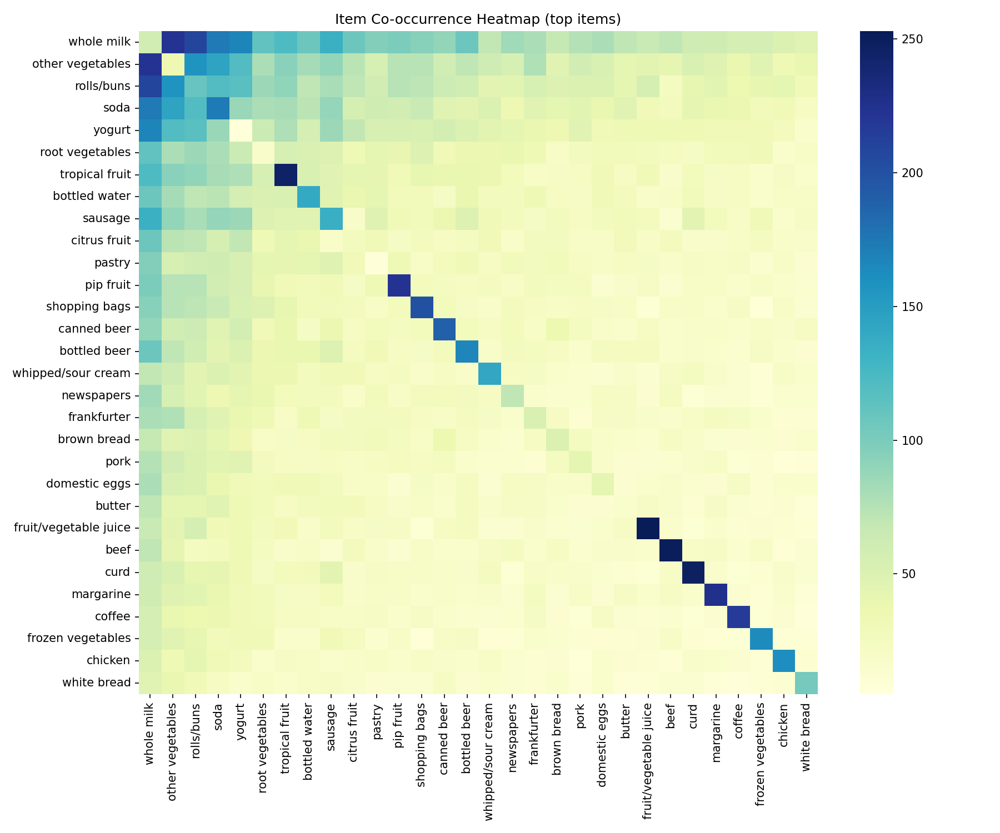

Grocery Item Recommender

This project implements a market basket analysis and item recommendation system using FP-Growth. It processes grocery transaction data, mines frequent itemsets, generates association rules, and provides recommendations for given items. The system is optimized for large datasets and avoids memory issues common with Apriori.

Features

Efficient FP-Growth algorithm for mining frequent itemsets.

Generates association rules with support, confidence, and lift.

Provides item recommendations for given transactions.

Guarantees recommendations even if no rules match (fallback to most frequent items).

Saves processed data as HDF5 for fast reuse.

Saves artifacts (MLB encoder, rules, frequent itemsets) as a pickle file.

Requirements

Python 3.9+

Pandas

MLxtend

scikit-learn

Joblib

Install dependencies using pip:

pip install pandas mlxtend scikit-learn joblib

Dataset

The system expects a CSV dataset with at least the following columns:

Date – transaction identifier (can be any unique identifier per transaction)

itemDescription – purchased item names

Optional: Member_number or other customer ID column

Example snippet:

Member_number	Date	itemDescription
1	2023-01-01	tropical fruit
1	2023-01-01	whole milk
2	2023-01-02	yogurt
Usage

Set the CSV input path in the script:

INPUT_CSV = r"C:\Users\NXTWAVE\Downloads\Groceries Price Detection\groceries.csv"

Run the script:

python grocery_recommender.py

Outputs generated:

processed_data.h5 – processed basket matrix for fast reloading

artifacts.pkl – saved objects including ML encoder, rules, frequent itemsets, and recommender data

Example recommendation:

sample_items = ['tropical fruit', 'whole milk']
recs = recommend(sample_items, recommender, top_n=5)
print("Recommended items:", recs)

Script Structure

preprocess_transactions – Groups items by transaction and converts to a one-hot basket DataFrame.

run_fp_growth_and_rules – Mines frequent itemsets and generates association rules.

build_recommender – Converts rules and item frequencies into a serializable recommender object.

recommend – Returns top-N recommended items given a list of purchased items.

save_pickle – Saves artifacts to disk for later use.

Notes

The recommender guarantees recommendations by filling missing recommendations with the most frequent items.

FP-Growth reduces memory usage significantly compared to Apriori, making it suitable for datasets with thousands of transactions and hundreds of items.

Artifacts are saved in pickle format, which can be loaded for batch or real-time recommendations without reprocessing the dataset.

Example Output
Loading dataset...
Dataset loaded. Shape: (38765, 3)
Transaction column: Date, Item column: itemDescription
Transactions: 728, Unique items: 167
Saved HDF5: processed_data.h5
Mining frequent itemsets and rules...
Found 147290 frequent itemsets, 595574 rules
Given items: ['tropical fruit', 'whole milk']
Recommended items: ['yogurt', 'other vegetables', 'rolls/buns', 'root vegetables', 'whole milk']
Saved PKL: artifacts.pkl
Done.

Author
SAGNIK PATRA
